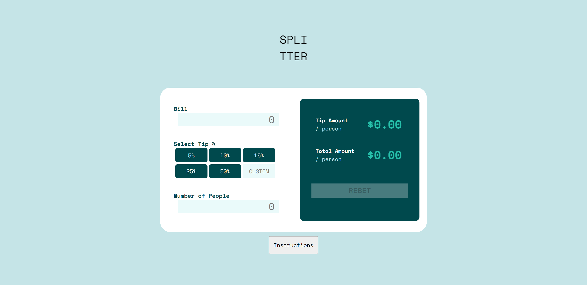
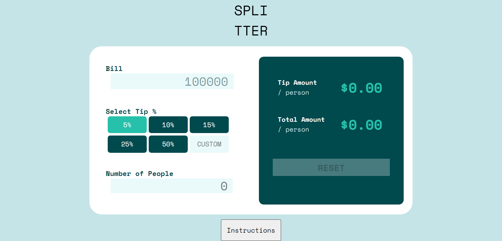
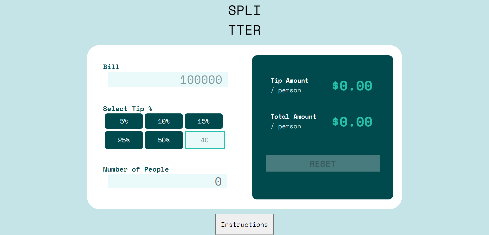
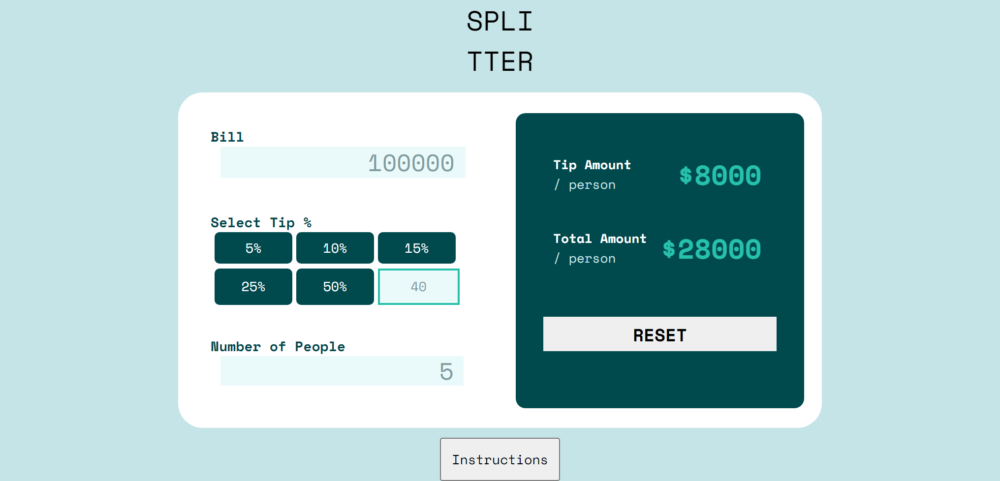
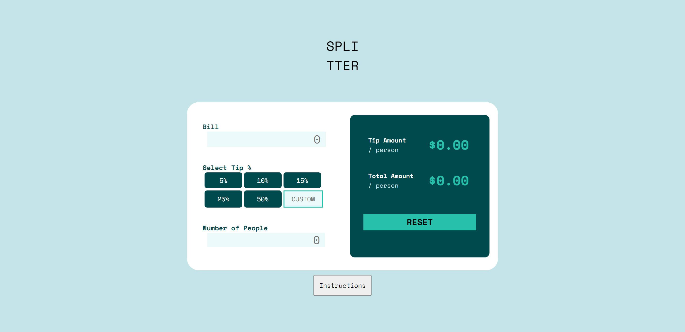
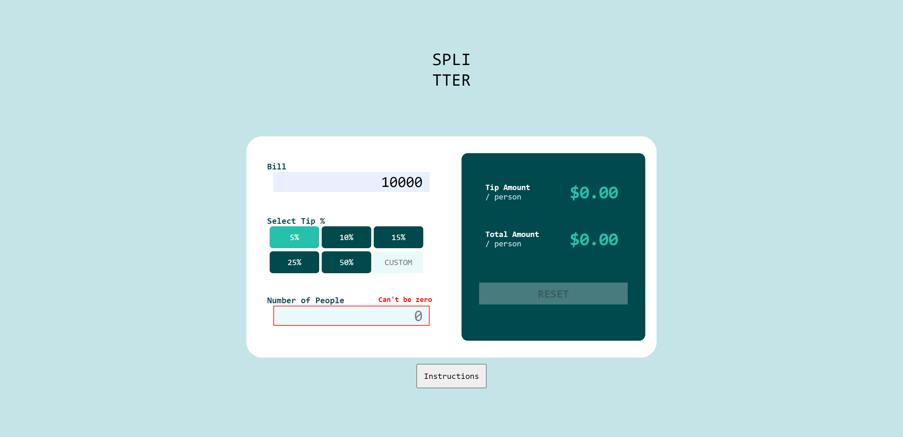
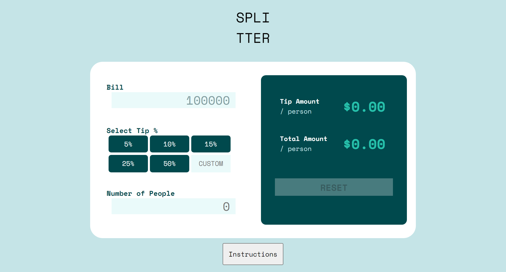
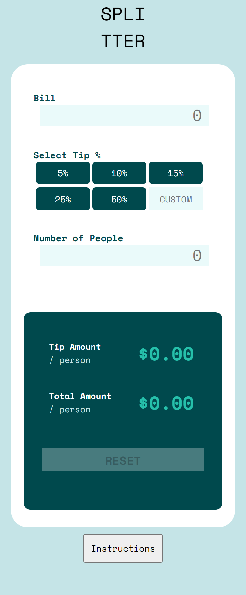

# FrontEndMentorChallenge8
Frontend Mentor - Tip calculator app solution

This is a solution to the [Tip calculator app challenge on Frontend Mentor](https://www.frontendmentor.io/challenges/tip-calculator-app-ugJNGbJUX). Frontend Mentor challenges help you improve your coding skills by building realistic projects.

## Table of contents

- [Overview](#overview)
  - [The challenge](#the-challenge)
  - [Screenshot](#screenshot)
  - [Links](#links)
- [My process](#my-process)
  - [Built with](#built-with)
  - [What I learned](#what-i-learned)
  - [Useful resources](#useful-resources)
- [Author](#author)

## Overview

### The challenge

Users should be able to:

- View the optimal layout for the app depending on their device's screen size
- See hover states for all interactive elements on the page
- Calculate the correct tip and total cost of the bill per person

### Screenshot
Active State

Normal View

  
  

### Links

- Solution URL: [Click me](https://github.com/arunsingh009/FrontEndMentorChallenge8)
- Live Site URL: [Click me](https://arunsingh009.github.io/FrontEndMentorChallenge8/)

## My process

### Built with

- Semantic HTML5 markup
- CSS custom properties
- Flexbox
- JavaScript
- DOM manipulation
- Media Queries

### What I learned

While peforming this task I came to learn more about validation and DOM manipulation.

### Useful resources

- StackOverflow
- W3School

## Author

- Website - [Arun Kumar Singh](https://arunkumarsinghportfolio.netlify.app/)
- Frontend Mentor - [@arunsingh009](https://www.frontendmentor.io/profile/arunsingh009)
- Twitter - [@arunsingh641997](https://www.twitter.com/arunsingh641997)

